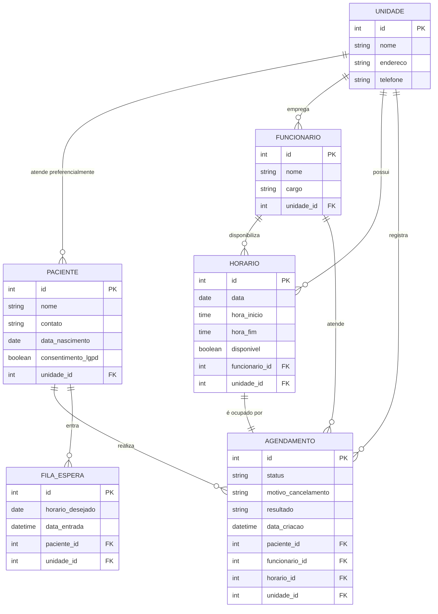

# Sobre este diagrama

O diagrama de entidade-relacionamento (DER) é uma representação visual de como os dados do sistema estão organizados e conectados entre si. 
Cada quadro representa uma entidade (uma tabela do banco de dados, como Paciente ou Agendamento), e as linhas entre elas 
representam os relacionamentos, ou seja, como uma informação se conecta a outra.

Segue abaixo alguns termos usados no diagrama:

- PK (Primary Key / Chave Primária) é o campo que identifica de forma única cada registro dentro de uma tabela.
  Por exemplo, cada paciente tem um id que nenhum outro paciente possui, evitando que dois cadastros diferentes sejam confundidos entre si.
- FK (Foreign Key / Chave Estrangeira) é o campo que faz a ligação entre duas tabelas diferentes, apontando para a chave primária de outra entidade.
  Por exemplo, um agendamento possui um paciente_id, que é uma FK apontando para o id (PK) da tabela Paciente, indicando a qual paciente aquele agendamento pertence.
- Cardinalidade é a notação que aparece nas linhas de conexão entre as entidades, indicando quantos registros de uma tabela podem se relacionar com registros de outra.

## Cardinalidade das relações (notação mín, máx)
| Relacionamento	| Entidade	| Cardinalidade	| Significado |
|-----------------|-----------|---------------|-------------|
| Unidade — Paciente |	Unidade	| (0,N) |	Uma unidade pode ter zero ou vários pacientes vinculados |
|                 |	Paciente	| (1,1)	| Cada paciente pertence a exatamente uma unidade |
| Unidade — Funcionário	| Unidade	| (0,N)	| Uma unidade pode ter zero ou vários funcionários |
|                 | Funcionário	| (1,1)	| Cada funcionário pertence a exatamente uma unidade |
| Unidade — Horário |	Unidade	| (0,N)	| Uma unidade pode ter zero ou vários horários cadastrados |
|                 |	Horário	| (1,1) |	Cada horário pertence a exatamente uma unidade |
| Funcionário — Horário	| Funcionário	| (0,N)	| Um funcionário pode disponibilizar zero ou vários horários |
|                 |	Horário	| (1,1)	| Cada horário está vinculado a exatamente um funcionário |
| Funcionário — Agendamento	| Funcionário	| (0,N)	| Um funcionário pode atender zero ou vários agendamentos |
|                 |	Agendamento	| (1,1)	| Cada agendamento tem exatamente um funcionário responsável |
| Paciente — Agendamento	| Paciente	| (0,N)	| Um paciente pode ter zero ou vários agendamentos |
|                 | Agendamento	| (1,1)	| Cada agendamento pertence a exatamente um paciente |
| Paciente — Fila de Espera	| Paciente | (0,N) | Um paciente pode entrar em zero ou várias filas de espera |
|                 |	Fila de Espera	| (1,1)	| Cada registro de fila pertence a exatamente um paciente |
| Horário — Agendamento	| Horário	| (0,1)	| Um horário pode estar livre (0) ou ocupado por um único agendamento (1) |
|                 |	Agendamento	| (1,1)	| Cada agendamento ocupa exatamente um horário |

## Como o diagrama foi construído

O diagrama foi criado no formato Mermaid, uma linguagem de texto que descreve diagramas e é renderizada automaticamente pelo GitHub dentro de arquivos .md, sem necessidade de gerar ou anexar uma imagem separada.

## Diagrama

